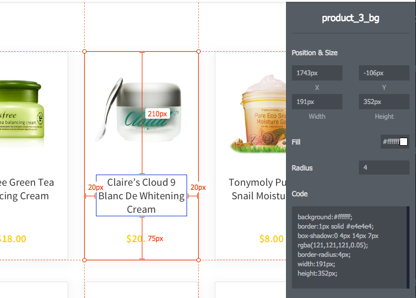

_NOTE: To any who stumble onto this, this is sandbox project that I've been using to experiment with various Javascript and React-related goodies.
It may or may not be live to play with in its current state at https://react-product-gallery.herokuapp.com/.
This README reflects the initial state of this example project repo._

# React Product Gallery

For this demo project, you will build a product gallery using React. The finished product should look visually similar to that of the provided mock ups as well as satisfy the requirements described the in the specs below. 
 
- The project consists of 2 primary screens: "Product Listing" and "Product Details".
- The required JSON data is provided for you. See `src/data.js`.
- You will not have to implement any HTTP requests to fetch the data. You may read the data directly from `src/data.js`.
- The project is designed to be completable in roughly 4 hours.
- Submit the project via email upon completion, providing a link to your project repository.

## Instructions

The project boilerplate is based around [create-react-app](https://github.com/facebookincubator/create-react-app#create-react-app)
 which means you don't have to worry about setting up any dependencies, build steps, boilerplate, etc...
 For additional information/instructions specific to `create-react-app` see https://github.com/facebookincubator/create-react-app#create-react-app-

- Clone this repo
- `cd example-react-product-gallery` and install dependencies via `yarn install`
- Execute `yarn start` to begin the development server.
- You should be able to reach the project at http://localhost:3000/

_*[`yarn`](https://yarnpkg.com) is interchangeable with [`npm`](https://www.npmjs.com/) throughout these instructions_

### Screen 01: Product Listing

_This screen displays a listing of products along with various search and filter controls._

**Display Products**

Display the appropriate products based on the current search and filter criteria.

Each product in the listing should be clickable to view the Product Details screen for that product.

**Search Products**

Search products via the text search input.

**View Products by Category**

Products are viewed by category. The categories should be listed in the sidebar.

**Filter by Price**
 
Filter products by min price and max price. Both fields being optional.

### Screen 02: Product Details

_This screen displays more detailed information about a single product._

**Modal**

The product details view is displayed within a modal. The modal should be closable by clicking the "X" in the top right corner of the modal.

### Utilizing the Prototype

See the [interactive prototype](prototype/index.html) to view and inspect the design. This prototype is generated from the actual design files, so the code itself won't be much use to you. Feel free to use it for easily inspecting sizes, spacing, and colors.

### _*Bonus Feature_

Select one bonus feature to implement:
- Add sorting options (e.g. sort by price lowest/highest).
- Add alternative Product Listing view (e.g. List view)
- Add to cart and display sub-total.
- Paginate items.
- Add tests.
- Add a "Related Products" section to the Product Details page.
